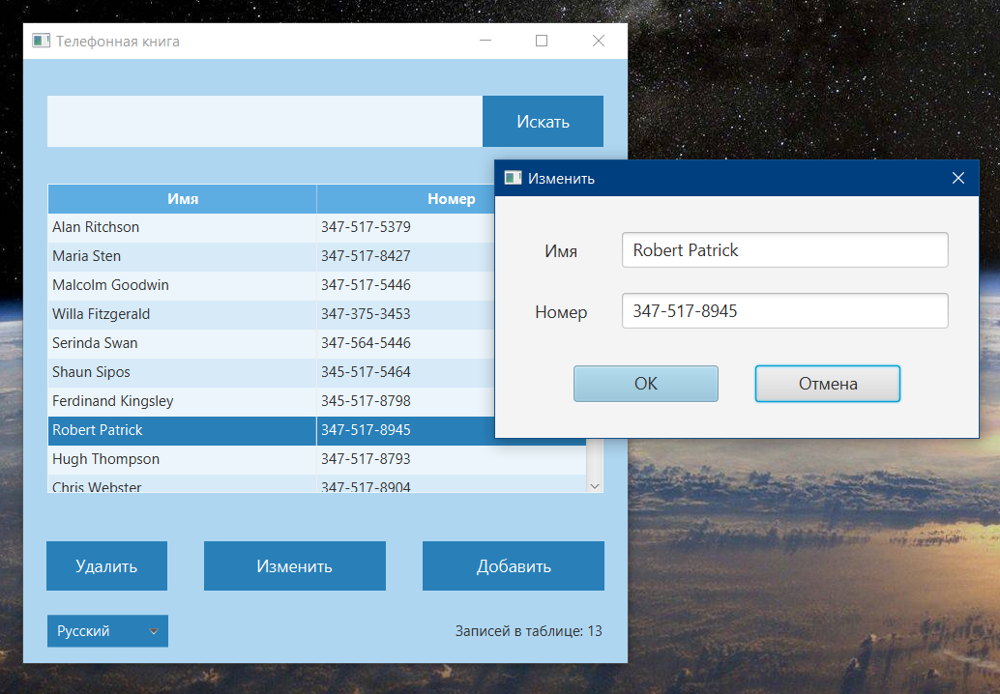

# PhoneBook

*учебный проект с курса javabegin "Адресная книга на JavaFX + БД SQLite"*

### Описание 

Приложение - список контактов, позволяющий создавать, редактировать, удалять, искать записи и отображать их в таблице на главном окне.

### Особенности

- на каждое действие `Удалить`, `Изменить`, `Добавить` появляется отдельное модальное окно с полями ввода или подтверждением удаления
- при ввводе текста в строку поиска и нажатии `Искать` результаты поиска отображаются в таблице главного окна. При очищении строки поиска в главном окне снова возвращаются все записи
- интерфейс окон реализован с помощью \*.fxml и \*.css-файлов
- поддерживаются две локализации интерфейса - русская и английская. Переключение производится из `выпадающего списка`. Локализации подключаются из отдельных properties-файлов
- данные хранятся в SQLite, обмен через JDBC

**В проекте использованы:**

- **JavaFX** для графического интерфейса
- **SQLite** как база данных

---

